# Ubuntu 23.04

## Tutorial Video

[Tutorial Video](https://www.youtube.com/watch?v=vIFwLgD54x8)

## Creating a Bootable USB on Windows

You will require:

* USB Flash Drives: >= 8 GB Capacity
* [Ubuntu 23.04 ISO](https://releases.ubuntu.com/lunar/)
* [Rufus](https://rufus.ie/en/)
* Latest BIOS Update ([Dell](https://www.dell.com/support/home/en-uk?app=drivers), [Lenovo](https://support.lenovo.com/gb/en/), [HP](https://support.hp.com/gb-en/drivers?gclid=Cj0KCQjwi46iBhDyARIsAE3nVrYeidxAKPNx_4lQafm2WA0P-c98deB6tE21oY43vOe4ENI_tScEBZgaAuFIEALw_wcB&gclsrc=aw.ds))

Insert the USB Flash Drive. Launch Rufus:


Accept the User account Control Prompt:


The USB Flash Drive should be automatically populated under Device. Select, select:


Select the Ubuntu 23.04 ISO image:


Change the partition scheme to GPT and the File System to FAT32 and then select Start:


Select Write in ISO Image mode and select OK:


Select OK at the warning to format the USB FLash Drive:


Rufus will format the USB Flash Drive and when finished the green status bar will say Ready. Select Close, to close Rufus:


Go to your OEMs Drivers and Downloads Page. Select your model:

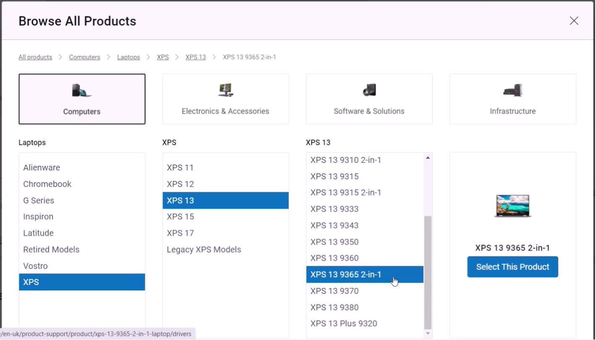

Select the BIOS category:


Select Download:


Copy the BIOS Update to your USB Flash Drive:


Your installation media is now ready.

## Creating a Bootable USB on Linux

You will require:

* 2 USB Flash Drives: >= 8 GB Capacity
* [Ubuntu 23.04 ISO](https://releases.ubuntu.com/lunar/)
* Make Startup Disk/Fedora Media Writer (Preinstalled)
* Latest BIOS Update ([Dell](https://www.dell.com/support/home/en-uk?app=drivers), [Lenovo](https://support.lenovo.com/gb/en/), [HP](https://support.hp.com/gb-en/drivers?gclid=Cj0KCQjwi46iBhDyARIsAE3nVrYeidxAKPNx_4lQafm2WA0P-c98deB6tE21oY43vOe4ENI_tScEBZgaAuFIEALw_wcB&gclsrc=aw.ds))
  
Select Startup Disc Creator:


Your installaiton ISO will be automatically selected if its in the Downloads folder. The Other button can be used to change the ISO if you have downloaded multiple ISO files. The USB FLash Drive dhold also be detected. Select Make Startup Disk:


Select Yes:


To proceed you will need to accept the Authentication Prompt. Input your password and select Authenticate:


The Bootable USB will be created:


When finished, Installtion Complete will display. Select Quit:


Your installation media is now ready. As the startup disc creates a single partition that is the size of the installation media, leaving the rest of the USB flash drive as unallocated space, you will need a seperate USB Flash Drive to copy the BIOS Update to.

## Dell UEFI BIOS Setup

A UEFI BIOS should be configured with Secure Boot. Unfortunately the Linux Kernel has no Intel RAID Driver and the SATA Operation should be configured to AHCI.

This will use a Dell XPS 13 9365 as an example. The BIOS screen will slightly differ from model to model and manufacturer to manufacturer.

For a Dell press ```F2``` while powering up to enter the UEFI BIOS Setup.

For a Lenovo press ```F1``` while powering up to enter the UEFI BIOS Setup.


In the General Tab select System Information:


Take note of the:
 
* Product Name: XPS 13 9365
* BIOS Version: 2.24.0
* Manufacturer Date: October 2017; this system had a replacement motherboard so lists no manufacture date 
* Processor: Intel i7-**7**V75 (7th Generation)
* Memory: 8 GB
* Video: Intel HD 615
* Audio: Realtek aLC3271
* Wi-Fi Device: Intel Wireless

In the General Tab select Advanced Boot Options:


No Legacy Options should be selected:


In the Secure Boot tab, select Secure Boot:


It should be Enabled:


In the System Configuration tab, select SATA Operation:


**Linux** has no RAID Storage Controller Driver. In order to recognise the NVMe SSD, the AHCI SATA Operation has to be used:


Under System Configuration, select Drives:


The drive type should listed. For best performance this should be a SSD:


In the Post Behaviour Tab, select FastBoot:


The default setting should be Auto. With this setting I often get a black screen on my system, with the keyboard backlight illuminated and an incomplete post. In order to get around this I need to hold down the power button for 30 s, wait 10 s and then power it up. Changing this Fast Boto Setting to Thorough reduces the chances of this happening: 


In past versions of Ubuntu the Wireless Card wouldn't be recognised when FastBoot was used. This seems to be fixed with a BIOS update/newer Linux Kernel. Previously the Wireless Card had to be Disabled after the Fast Boot Behaviour was set to thorough using the Wireless switch. Then the system had to be powered on and off. Finally enabling the Wireless Card has to be Enabled using the Wireless switch.

selecting the Wireless Tab, select Wireless Switch:

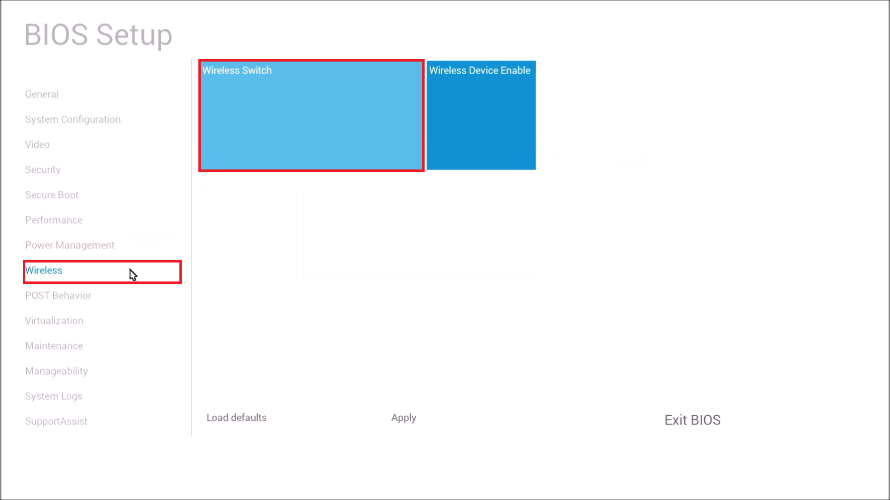

Make sure both WLAN and Bluetooth are selected. Turn off the Wireless Card using the Wireless switch. Then power off the system


In the Performance Tab, the performance related technologies can be checked. These should all be enabled:


In the Virtualisation Tab, the virtualisation technologies can be checked. These should all be enabled:


In the Maintenance Tab, select Data Wipe:


Check Start Data Wipe:


Select OK:


Select No:


In the General Tab, select Boot Sequence:


Scroll down:


Select Remvoe Boot Option:


Check all old Boot Entries, leaving the Ubuntu 23.04 UEFI Bootable USB Flash Drive unchecked and select Remove selected Devices:


Now only the Ubuntu 23.04 UEFI Bootable USB Flash Drive should display:


Select Apply, then OK:


Select Exit BIOS:


The system will now reboot to the Data Wipe prompt. **This will Securely Erase all Internal Drives**, external USB Devices such as the Ubuntu 23.04 Bootable USB will be untouched. Use the arrow keys and highlight Continue and press Enter:


Use the arrow keys and highlight Erase and press Enter:


The data wipe will proceed:


You will be informed when it is finished:


Data Wipe typically takes a couple of minutes for a SSD but can take several hours for a HDD.

## BIOS Update from USB

For best results, ensure your system has the latest BIOS Update installed before installing Ubuntu as many boot issues are resolved using the BIOS Update.

The Dell BIOS can be updated from USB. To access the Dell or Lenovo Boot Menu press ```F12``` during powerup:


Select BIOS Update:


Select Flash from File:


Select the USB Flash Drive:


Scroll down and select the BIOS Update:


Then select Submit:


Then select Update BIOS:


Select Confirm Update:


The BIOS will now update:


## Ubuntu Live USB

To access the Dell or Lenovo Boot Menu press ```F12``` during powerup:


Notice that a UEFI Boot with Secure Boot is shown. Select the Ubuntu 23.04 UEFI Bootable USB:


Press Enter to Try or Install Ubuntu:

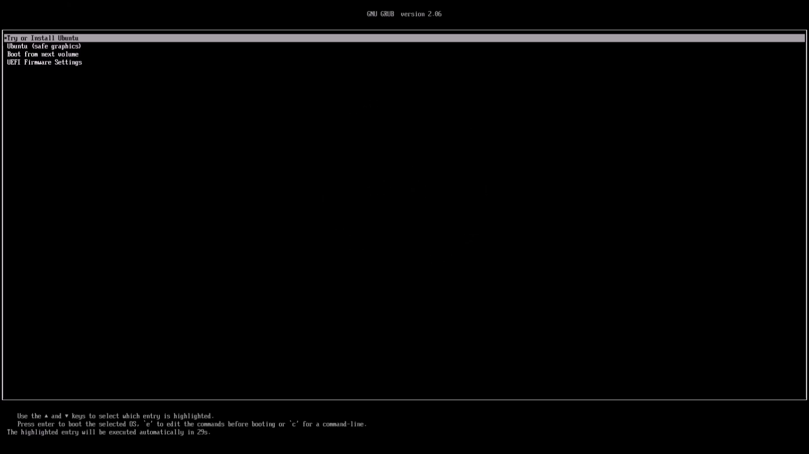

The Ubuntu Splash screen will display:


Select your language and then select Next:


Select Install Ubuntu and then select Next:


## Installing Ubuntu

Select your keyboard layout and then select Next:

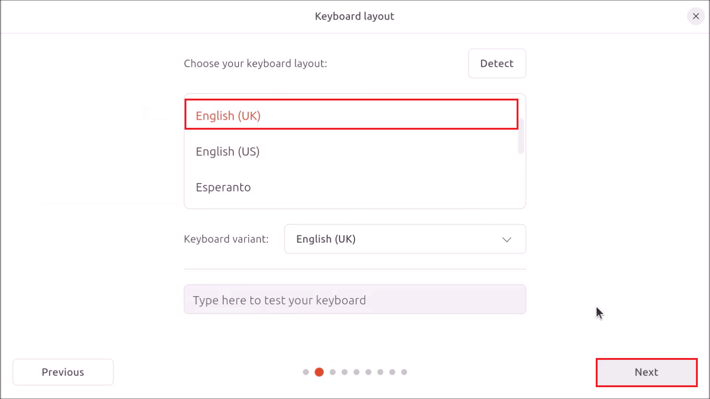

Select Connect to a Wi-Fi network and select Connect:


Input your Network Password and select Connect:


Select Next:


Select Normal Installation and check Install third-party software for graphics and Wi-Fi hardware. Select Download and install support for additional media formats. Then select Next.

The third-party drivers and the multimedia codecs are now all digitally signed, so there is no need to configure a Machine Owner Key (MOK) like in previous versions of Ubuntu.


Select Erase disk and Install Ubuntu and select Next:


Details about the proposed changes to the drive will be displayed. To proceed select Install:


To get your timezone select your location on the map and select Next:


Input your:

* Full Name
* Computer Name
* Username (all lower case, no spaces)
* Password
* Password Confirmation

Leave require my password to log in checked and select Next:


Select your theme and selet Next:


Ubuntu will now install, When finished you will be prompted to Restart. Select Restart Now:


The Ubuntu spalsh screen will display, instructing you to remove your USB Flash Drive and press Enter:


Once you have done this the computer will reboot.

## Out of the Box Experience 

You will see the OEM logo and the Ubuntu splash screen:


You will then be taken to the logon screen. Select your username:


And input your password to log in:


You will be presented with some Out of the Box Experience (OOBE) setup screens. Optionally connect to Online Accounts:


Optionally submit system information to Canonical:


Optionally enable Location Services, these are eneds for maps and regional news etc:


The final OOBE setup screen informs you about Software:


You have now installed Ubuntu:


## Panel and Apps Screen

To the left is the Panel, GNOMEs equivalent of a taskbar. It has an All Apps button:


Which bring you to the All apss screen:


Apps can be unpinned from the panel. When they are unpinned, they appear on the All Apps screen:


They can be dragged to a desired location:


Dragging one App on top of another creates a folder:


Apps can be pinned to the panel, remvoing them from the all Apps screen:


## Software Updater

Ubuntu is Debian based and inherits the Software Updater and related Software & Update Settings from Debian. The Software Updater is only used on Ubuntu to check for Operating SYstem Updates:


The Software & Update Settings can change some advanced udpate settings:


Generally these are all left at their defaults


The most important component of the Software & Update Settings is the Additional Drivers tab. This is only used when your system has a device with a closed source driver. Most devices have open-source drivers which are worked on by both the chip manufacturer and the kernel developers to give the most stable OOBE. Some chip manufacturers did not release open-source drivers resulting in a basic driver essentially hacked together by the kernel developers for an OOBE and usually a separate closed-source driver released by the chip manufacturer. The closed-source driver usually increases functionality of the device but can lack performance and stability tweaks from the kernel developers which optimise stability of the driver with the Linux kernel. The biggest culprit for this has historically been Nvidia however they have recently been releasing open-source drivers alleviating the problems with their devices. In the future the Additional Drivers tab should essentially be made redundant when an open-source kernel driver is used for Nvidia devices.


The Additional Drivers tab also has its own additional icon:

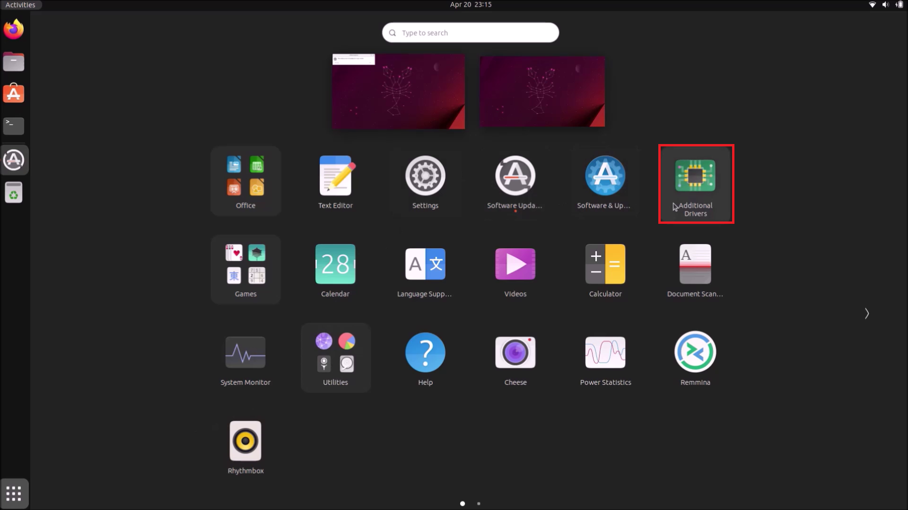

## Settings

Ubuntu uses a modified GNOME Desktop Environment, giving functionality more familiar to a new user coming across to Linux from Windows and offering additional customisation options such as accent colours.

GNOME Settings contain most the settings for the GNOME Desktop environment:


Select Accessibility:


Enable the Accessibilty Menu:


This gives options such as large text as well as the onscreen touchscreen keyboqrd:


In appearance, select teh accent colour and background:


In Ubuntu Desktop, the Desktop Icons behaviour can be changed:


The panel can also be configured to autohide giving more screen space:


The panel can also be configured to be a centred dock which resizes depending on the number applications open on the dock:


The panel/dock position can be changed from the left to the bottom. Unfortunately the all apps button is on the right hand side in this configuration, opposed to the elft, which may be more familiar to users coming to Linux from Windows:


The Activities button on the top left of the panel displays all open apps. 


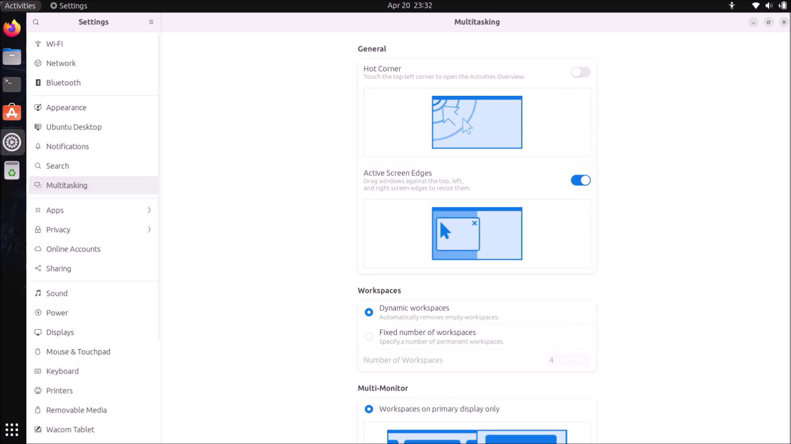


In this case only one app is open, which is why only it appears.

## Software

Software is used to install third-party applications available as snap packages. To search for an application, select the search icon and just start typing. Select the application:


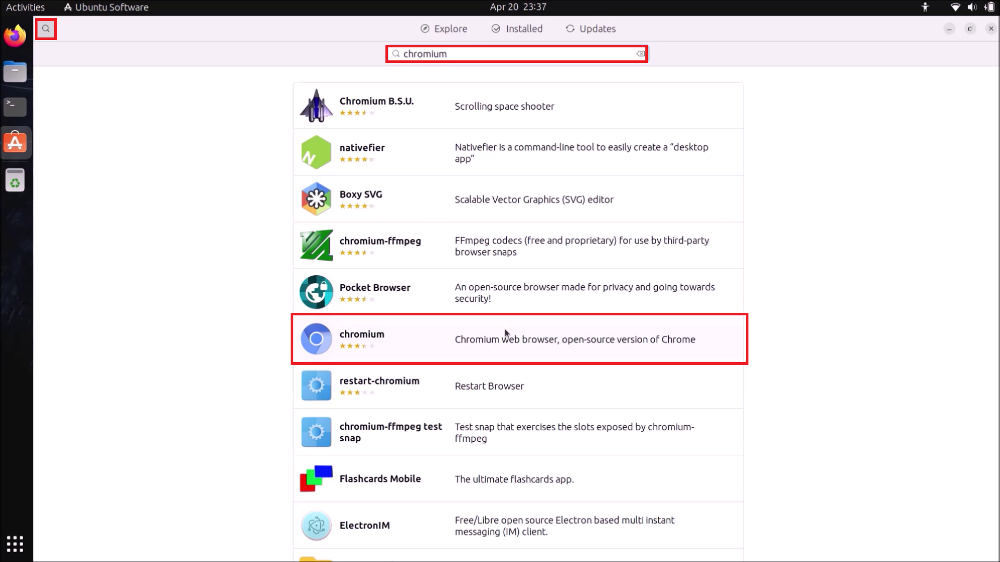

Then select install:


The authenticate prompt will display, input your password and select authenticate:


The software snap package will now be installed:


## Browsers

Ubuntu comes with the Firefox snap package preinstalled, the open source Chromium snap package is commonly installed.


## Office Suites

Ubuntu comes with the Libre Office suite preinstalled as snap apckages. The OnlyOffice Desktop Editors suite is often preferred by users more familiar with Microsoft Office:


In the past this Office Suite was quite limited but it has been undergoing rapid development and its Document, Spreadsheet and Presentation can be used to carry out the most common tasks in Word, Excel and PowerPoint. Unfortunately it does not include a program that has analogous functionality to Visio.

The Presentation sadly does not open a presentation in full screen, meaning it needs to be manually maximised. Hopefully this will be fixed in a later version.

## Screen Capture

The Print Screen button will open the GNOME screen capture:


It can be used to capture a window or to capture the full screen:


Alternatively if the minimise button is right clicked, the GNOME context menu will open displaying the option to take a screenshot:


Alternatively a selection can be made:


## Image Manipulation Programs

Ubuntu comes with a preinstalled image viewer:


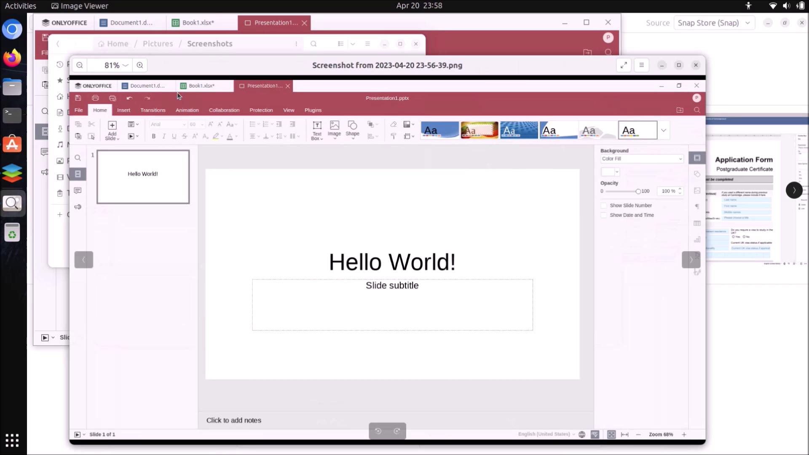


There are some issues with the screen capture: 

* The notification that a screen capture has been made is often captured if a full screen capture is used sequentially.
* The window capture by default adds a large blank border around each window and there is no option to disable this.

Ubuntu also lacks a preinstalled image manipulation program:


The most commonly used image manipulation program on Linux is GIMP:


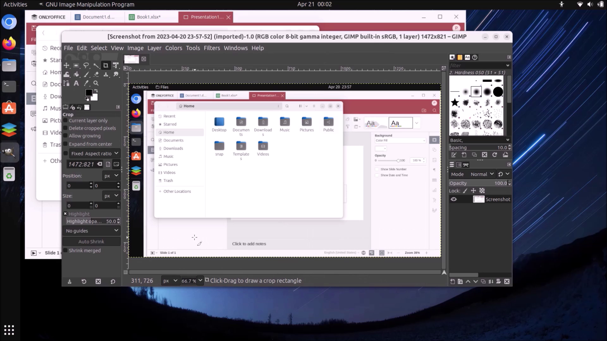

However it is often overly compicated for manipulation of a screenshot. The closet paint equivalent is Drawing or KolourPaint:


Both these programs resemble the Windows XP version of paint and are highly outdated. KolourPaint is also unusable on a system with a high DPI screen. Linux could really do with a mdoern paint eqivalent program.

## Video Capture

GNOME screen capture can also do screen recordings:


A timer displays in the top right hand corner and can be sued to stop the screen recording:


For some reason videos complains about lack of a multimedia codec and takes the user to Software which can't find the multimedia codec. Despite the warning it appears to play the video;


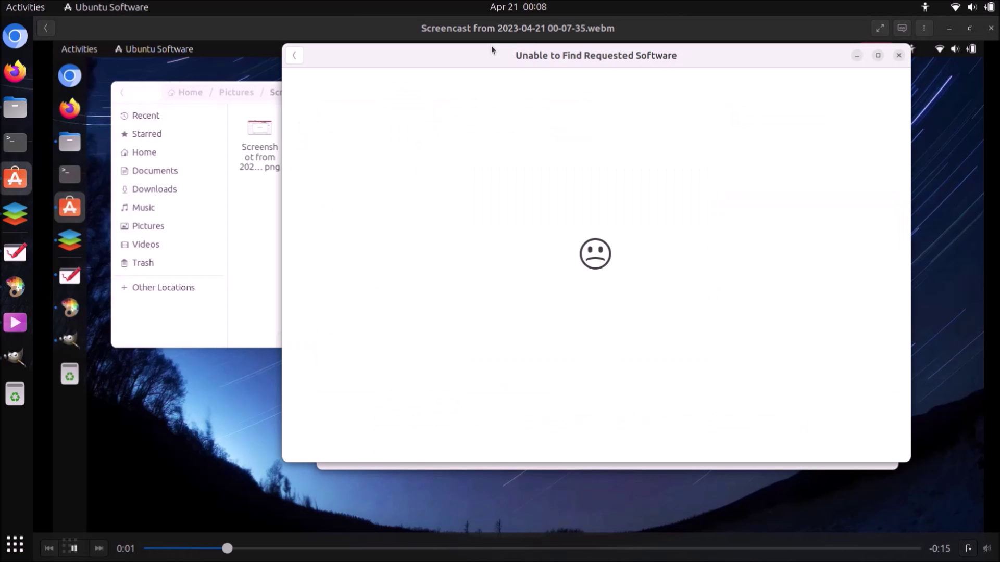

VLC Player can also instead be used:


One major issue with GNOME screen recording is it does not record the mosue movement and there is no option to do so.

## Video Editor

One of the most common video editors on Linux is KdenLive:


This program is a more functional but more complicated in user interface than its Windows Live Movie Maker counterpart.

## Extension Manager

The GNOME Extension Manager can be installed to enable third-party GNOME Extensions:


Note 3 extensions are enabled, these extensions are developed by Canonical as Ubuntu uses a modified GNOME Desktop Environment:


Other Extensions can be installed. Particularly common extensions are the Application Menu:


And clipboard history:


**Excessive use of extensions may lead to instability ofthe GNOME Desktop environment.**

## Tweaks

Tweaks is essentially, additional settings that the GNOME developers didn't want to incorporate directly into Settings. The most commonly used tweaks are already configured by Canonical such as the addition of the minimise and maximise button giving a window management that minimises windows to the panel; similar to the windows management of Windwos taskbar:


The pointer location can also be enabled by use of the Ctrl key:


The Touchpads Mouse Click Emulation can be changed. GNOME by default uses Fingers which favours finger gestures, essentially pressing down with 1 finger gives a left click and rpessing down with two gives a right click. Canonical have already modified Ubuntu to use Area which gives a left and right click using the bottom elft and right of the touchpad. The third finger gesture or middle click didn't work on my system, so presumably Canonical have disabled this elsewhere.

## Touchscreen

The Linux Kernel has inbuilt support for a Touchscreen. The GNOME Desktop Environment also includes a screen keyword in the accessibility menu:


The screen keyboard is invoked for most commonly preinstalled applciations such as the file explorer, text editior and terminal. It unfortunately lacks in support for other applications.

## Firefox Touchscreen Issue

The Firefox snap package uses a legacy touch input method and doesn't autopopulate the screen keyboard or respond to any presses on the touchscreen unlike its equivalent rpm package found preinstalled with Fedora:


When attempting to scroll through text on a webpage, text is highlighted instead:


This can be fixed by opening up a terminal pressing ```Ctrl```, ````Alt``` and ```t``` and inputting the following two lines of code:

```
echo export MOZ_USE_XINPUT2=1 | sudo tee /etc/profile.d/use-xinput2.sh
sudo reboot
```


The touchscreen interface now works and scrolls instead of highlighting text:


## Chromium Legacy Text Input Protocol

The screen keyboard uses a newer text input protocol but support for the Chromium browser only supports the depreciated version 1. As a result the screen keyboard won't auto-populate when a touch input field is pressed into on Chromium. For more details see:

[Chromium Ozone-wayland: support text_input_v3 protocol](https://bugs.chromium.org/p/chromium/issues/detail?id=1039161)


Apparently the screen keyboard uses a newer input protocol but the Chromium broweser is stuck on the older protocol:


Chromium otherwise responds well to touch and scrolls correctly:


Many programs are electron applications which use Chromium as a dependency and therefore inherit the lack of support for the newer text input protocol:


## Improved OSK Extension

In the meantime, the extension Improved OSK as the name suggests improves the experience of the onscreen keyboard. Install the extension:


Go to the extensions settings:


Enable force touch input and show statusbar icon:


The statusbar icon can be used to force populate the screen keyboard and is a workaround that must be used until Chromium is updated to support the new text input protocol:


## Device Rotation

The GNOME Desktop environment by default:

* Does not rotate the screen when the system is in laptop mode.
* Rotates the screen when the system is in tent mode or tablet mode.


Unfortunately it is slow to rotate the screen and it is possible to be left with this configuration:


The extension screen rotate will isntead rotate the screen (faster) in laptop mode, tent mode and tablet mode:


## Fractional Scaling

Unfortunately fractional scaling is not enabled by default:


Enablign it manually to 200 % resizes the desktop environment out of the screen i.e. the screen only takes up one quarter. 


Press ```Ctrl```, ```Alt``` and ```t``` to open up the terminal and input to restart:

```
sudo reboot
```

Not having fractional scaling makes it an irritation to wrok with a high DPI laptop touchscreen monitor and a traditional DPI desktop screen:


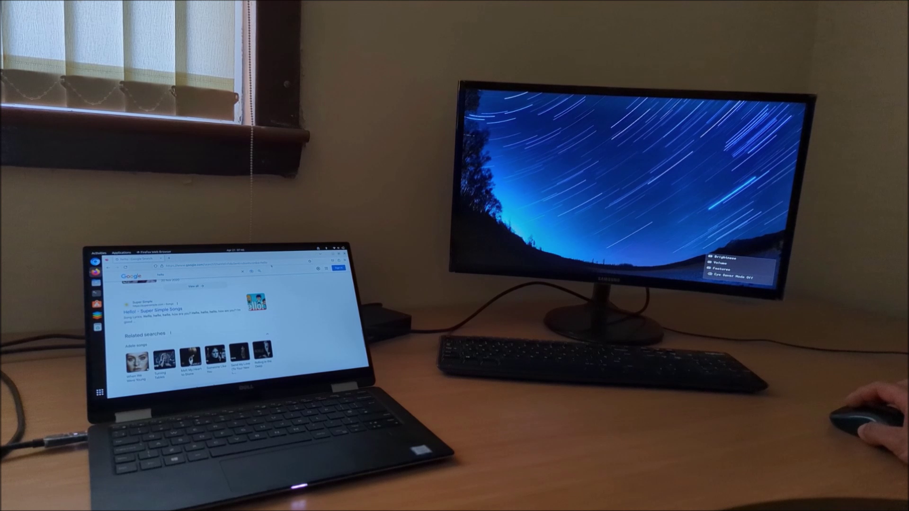


Enabling High DPI scaling makes it possible to work with both screens:


GNOME Window snapping across multiple monitors is limited with ```⊞```+```→``` or ```⊞```+```←``` or ```⊞```+```↑``` not being able to move a window from one monitor to another.

The gsnap and wintile extensions are supposed to enable this behaviour but have not yet been updated to support GNOME 44.